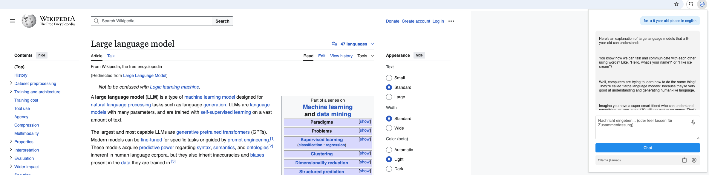

# FreeGPT Chrome Extension

A Chrome extension that allows you to chat with various LLM providers about web page content. Unlike many similar tools that use freemium models or require paid subscriptions, FreeGPT is completely free and open, especially when used with your own Ollama server.



## Project Scope

While the extension supports URL tracking functionality with a tracking server, this is not the main focus of the project. A simple sample server is included for debugging purposes, but the core functionality is the Chrome Extension itself with its LLM integration capabilities. If you need a production-ready tracking server, you'll need to implement it separately according to your requirements.

## Why FreeGPT?

- 🆓 **Truly Free**: No hidden costs, no premium features, no usage limits
- 🔒 **Privacy-Focused**: Use your own Ollama server for complete data control
- 🌐 **Flexible**: Also supports commercial providers (OpenAI, Anthropic) if desired
- 💪 **Powerful**: Full-featured chat interface with the same capabilities as premium tools
- 🎯 **No Vendor Lock-in**: Switch between providers or use your own models

## Features

- 🤖 Support for multiple LLM providers:
  - Ollama (local models, completely free)
  - OpenAI (GPT-4, etc., requires API key)
  - Anthropic (Claude, requires API key)
- 🌐 Multilingual support (English, German)
- 📝 Markdown rendering for responses
- 🔊 Speech-to-text input
- 📋 Copy conversation to clipboard
- 🔗 Optional URL tracking
- 🎨 Clean, modern UI

## Installation

1. Clone this repository:
   ```bash
   git clone https://github.com/yourusername/freegpt-chrome-extension.git
   ```

2. Open Chrome and go to `chrome://extensions/`
3. Enable "Developer mode" (top right)
4. Click "Load unpacked" and select the extension folder

## Configuration

### Ollama Setup (Recommended, Free Option)

Ollama must be started with CORS support for the extension to access it:

```bash
OLLAMA_ORIGINS=* ollama serve
```

For the Desktop App: Stop Ollama and restart it with:

```bash
export OLLAMA_ORIGINS=*
/Applications/Ollama.app/Contents/Resources/ollama serve
```

### Extension Settings

1. Click the extension icon and select "Options"
2. Configure:
   - LLM Server (Ollama recommended for free usage)
   - API Key (only if using OpenAI or Anthropic)
   - Model selection
   - Optional URL tracking settings

## Usage

- Click the extension icon on any webpage
- Type your question or leave empty for a page summary
- Use the microphone button for voice input
- Copy conversations to clipboard
- Optionally save URLs and conversations to your tracking server

## Development

The extension is built with vanilla JavaScript and uses:
- Chrome Extension APIs
- Web Speech API for voice input
- Marked.js for Markdown rendering

## Contributing

1. Fork the repository
2. Create your feature branch (`git checkout -b feature/AmazingFeature`)
3. Commit your changes (`git commit -m 'Add some AmazingFeature'`)
4. Push to the branch (`git push origin feature/AmazingFeature`)
5. Open a Pull Request

## License

This project is licensed under the MIT License - see the LICENSE file for details. 